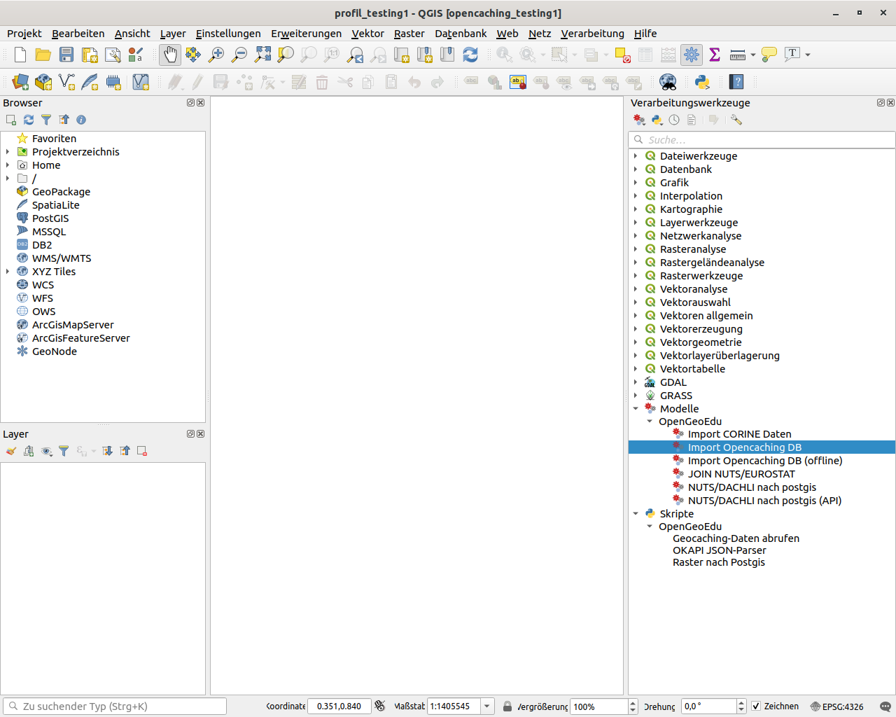

# Processing-Werkzeuge, Workflows und SQL-Anweisungen zur Übung 'OpenCaching'

Dieses Repositorium enthält Ressourcen und Werkzeuge, die für die Umsetzung die zur Auswertung von GeoCaching-Daten der Plattform https://www.opencaching.de/ im Zusammenhang mit europäischen Statistiken (siehe https://ec.europa.eu/eurostat) und Landnutzungsdaten (siehe https://land.copernicus.eu/pan-european/corine-land-cover/).

Die Auswertung ist Gegenstand einer Übung des offenen Onlinekurses OpenGeoEdu im Rahmen des gleichnamigen Projektes (https://www.opengeoedu.de). Ausführliche Anleitungen dazu werden bald im **Kursteil Open Data** veröffentlicht:

* Vorlesungsteil Open Data: https://learn.opengeoedu.de/opendata
* Übungsteil Open Data: https://ilias.opengeoedu.de/ilias/goto_opengeoedu_crs_249.html

## Software

Die hier enthaltenen Ressourcen wurden mit den folgenden Anwendungen entwickelt:

* QGIS 3.8
* PostgreSQL 11.5 mit der Erweiterung Postgis 2.5.3

## Ordnerstruktur

- **models:** Enthält Modelle und Workflows im Format des QGIS 'Graphical Modeler'
- **scripts:** Enthält Python 3-basierte Skript-Dateien, die mit der Processing-Toolbox (Werkzeugkasten) und als Teil von QGIS-3 Workflows ausgeführt werden können.
- **sql:** Enthält SQL-Skripte zur Datenmodellierung und Auswertung mit PostgreSQL und Postgis
- **documentation:** selbsterklärend

## Verwendung der Processing-Werkzeuge mit QGIS 3

Die einfachste Möglichkeit, die Processing-Skripte und Modelle in QGIS 3 einzubinden, ist es ist es, die Dateien der Ordner **"models"** und **"scripts"** in die gleichnamigen Verzeichnisse Ihres QGIS-Benutzerprofils zu verschieben und **QGIS dannach zu (neu-)zustarten**. Sie können diese Pfade unter `Einstellungen > Optionen > Reiter "Verarbeitung > "Modelle" bzw. "Skripte"` einsehen und anpassen. Für den Standardbenutzer "dafault" benutzt QGIS standardmäßig die folgenden Ordnerpfade:

**Windows-Pfade:**
[Ergänzen]

**Linux-Pfade:**
* ~/.local/share/QGIS/QGIS3/profiles/default/processing/models
* ~/.local/share/QGIS/QGIS3/profiles/default/processing/scripts

Alternativ können Sie die Dateien auch einzeln aus der Werkzeugkasten   heraus über die Optionen (Rechtsklick) 
 /  `> Modell / Skript zum Werkzeugkasten hinzufügen...` auswählen.

Wenn die Werkzeuge richtig eingebunden haben, sollten die Skripte und Modelle im Werkzeugkasten jeweils in der Gruppe "OpenGeoEdu" erscheinen:

Weitere Informationen zum Laden von QGIS-Processingwerkzeugen:
https://docs.qgis.org/testing/en/docs/user_manual/processing/modeler.html#saving-and-loading-models
